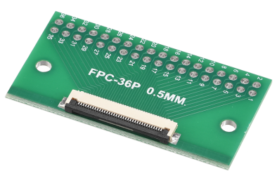
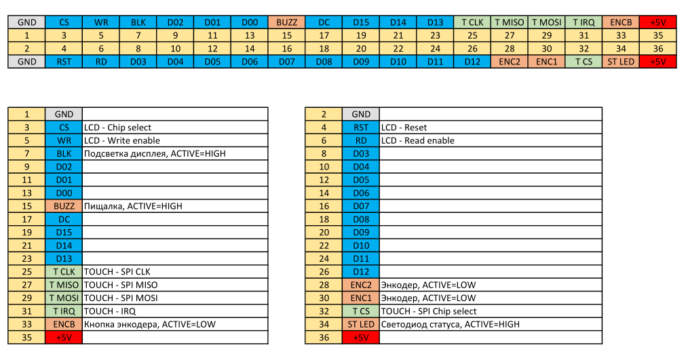
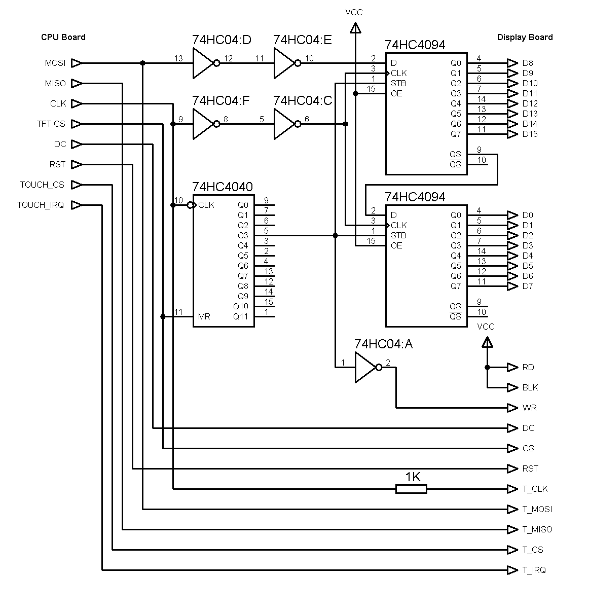
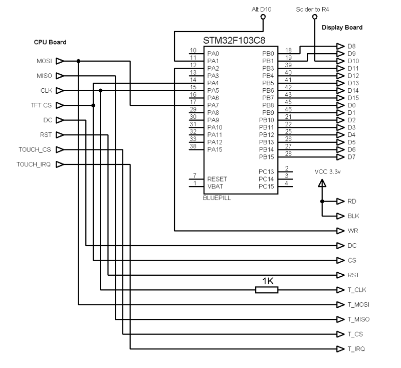
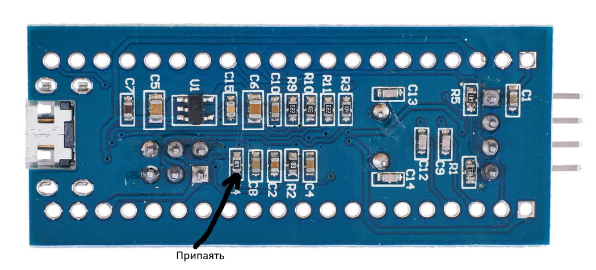

# Подключение дисплея Lerdge
Плата дисплея основана на LCD контроллере ST7796s и контроллере тачскрина XPT2046.

ST7796s на этой плате может работать только в паралельном 16 битном режиме, для подключения его к OrangePi или RaspberryPi необходимо заставить его работать по SPI шине.

Реализовать конвертацию можно двумя способами, собрать конвертер на сдвиговых регистрах 74HC4094 или использовать плату на STM32F103C8 называемой в народе BluePill.

# Распиновка платы дисплея
Для подключения платы дисплея, я использовал такой переходник, в принципе можно использовть и переходник на 40 контактов - тогда шлейф надо сдвинуть ближе к первому контакту.

[Купить можно тут](https://aliexpress.ru/item/1005003044150117.html?sku_id=12000023422069312) или [тут](https://voltiq.ru/shop/fpc-ffc-dip-flat-cable-loop-adapter/?attribute_pa_cable-loop-type=40-pins)






# Установка драйвера дисплея в Linux
Для начала установим драйвер дисплея, драйвер собран на основе наработок [Sergey1560](https://github.com/Sergey1560/fb_st7796s)

Отличия только в том что здесь мы будем использовать 16 битную шину для команд и данных дисплея, а также для Lerdge необходимо при инициализации инвертировать дисплей.

Для сборки модуля понадобится пакеты build-essential и linux-headers.
В некоторых дистрибутивах linux-headers уже установлен по умолчанию (например сборка для OrangePi от [silver-alx](https://github.com/silver-alx/sbc/releases/tag/3.0.8))

Сначала определим какую версию ядра мы используем:
```
pi@klipper:~$ uname -r
5.16.17-sun50iw9
```

Нас инетересует архитектура, которая указана после версии ядра, в данном примере это **sun50iw9**

Найдем пакет который нам необходимо будет установить
```
pi@klipper:~$ sudo apt-cache search linux-headers-current
linux-headers-current-sun50iw9 - Linux kernel headers for 5.16.17-sun50iw9 on arm64 current
```

Установим необходимые для сборки пакеты 
```
sudo apt update
sudo apt install git build-essential linux-headers-current-sun50iw9
```

Склонируем репозиторий с кодом драйвера и соберем его:
```
git clone https://github.com/trambouter/fb_st7796s_lerdge.git
cd fb_st7796s_lerdge/kernel_module/
make
sudo make install
make clean
sudo depmod -A
```

Если мы хотим чтобы драйвер загружался при старте системы, его нужно добавить в initramfs.
```
sudo bash -c 'echo "fb_st7796s" >> /etc/initramfs-tools/modules'
sudo update-initramfs -u
```

Дальше нам необходимо будет указать ядру как работать с этим драйвером, для этого будем использовать пользовательские overlays.

Перейдем в директорию dts и посмотрим список доступных плат:
```
cd ../dts/
ls 
```

Находим необходимую нам нам плату, например opizero2_st7796s.dts и выполняем следующую команду:
```
sudo armbian-add-overlay opizero2_st7796s.dts
или
sudo orangepi-add-overlay opizero2_st7796s.dts
```

В dts файле можно попровать изменить spi-max-frequency, этот параметр указывает на какой частоте будет работать дисплей. На 10мгц работает медленно, но для klipperscreen хватает. На 30мгц - уже очень комфортно работать с дисплеем.

# Схема конвертера SPI в 16bit


# Использование STM32F103C8 для подключения
[Репозиторий с кодом для SMT32 для PlatformIO](https://github.com/trambouter/stm32_spi2bus_lerdge)

Схема подключения:


Есть одна особенность - если хотите чтобы диспей работал быстро - желательно припаять провод к резистору R4 - это будет выход контроллера PB2, который не выведен на гребенку контактов. Этот контакт подключается к входу дисплея D10, если использовать такой вариант - то код работает намного быстрее и работу шины SPI спокойно можно разогнать до 30мгц (если разогнать саму stm32 до 112мгц или 124мгц)




Если не припаиваться к этому резистору - то выход D10 для дисплея необходимо будет взять с выхода PA1, и в коде для stm32 раскоментировать строку **GPIOA->BSRR = (RX_D & 0x0004) ? GPIO_BSRR_BS1 : GPIO_BSRR_BR1;**

# Подключение OrangePi Zero

|	|	|
|---|---|
|MOSI|PA15|
|MISO|PA16|
|CLK|PA14|
|TFT_CS|PA10|
|DC|PA19|
|RST|PA18|
|TOUCH_CS|PA02|
|TOUCH_IRQ|PA03|

# Подключение OrangePi Zero2

|	|	|
|---|---|
|MOSI|PH7|
|MISO|PH8|
|CLK|PH6|
|TFT_CS|PC10|
|DC|PC15|
|RST|PC14|
|TOUCH_CS|PC7|
|TOUCH_IRQ|PC8|

# Подключение OrangePi 3 LTS

|	|	|
|---|---|
|MOSI|PH5|
|MISO|PH6|
|CLK|PH4|
|TFT_CS|PL8|
|DC|PD15|
|RST|PD16|
|TOUCH_CS|PC7|
|TOUCH_IRQ|PC8|

# Настройка Xorg и KlipperScreen
Пока не готово.

